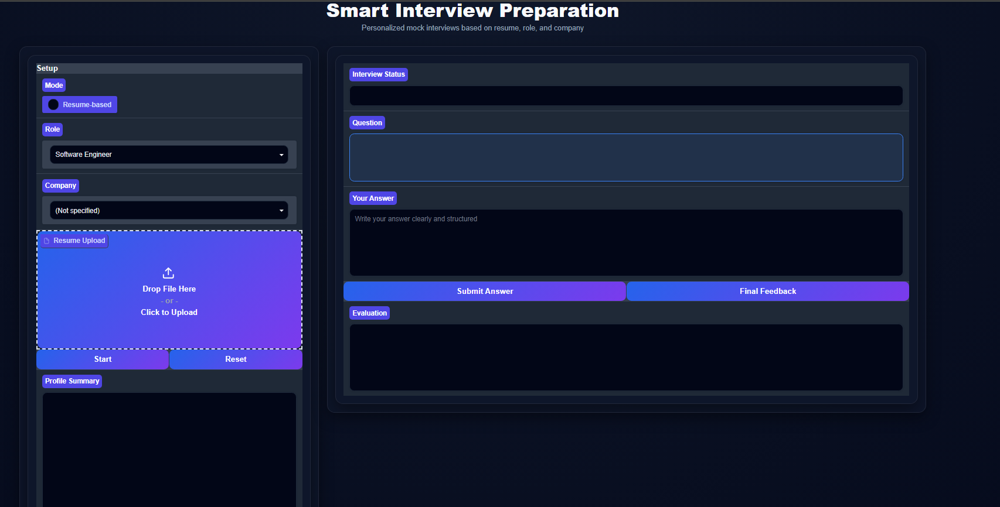
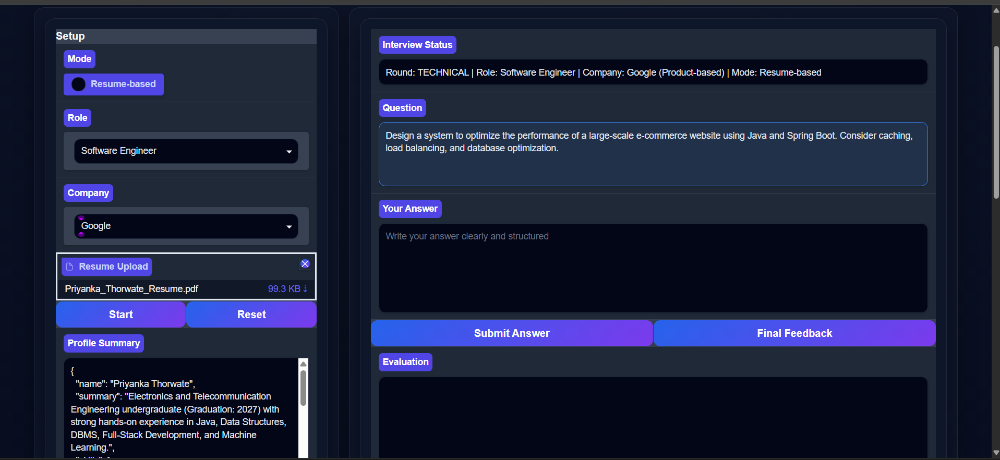
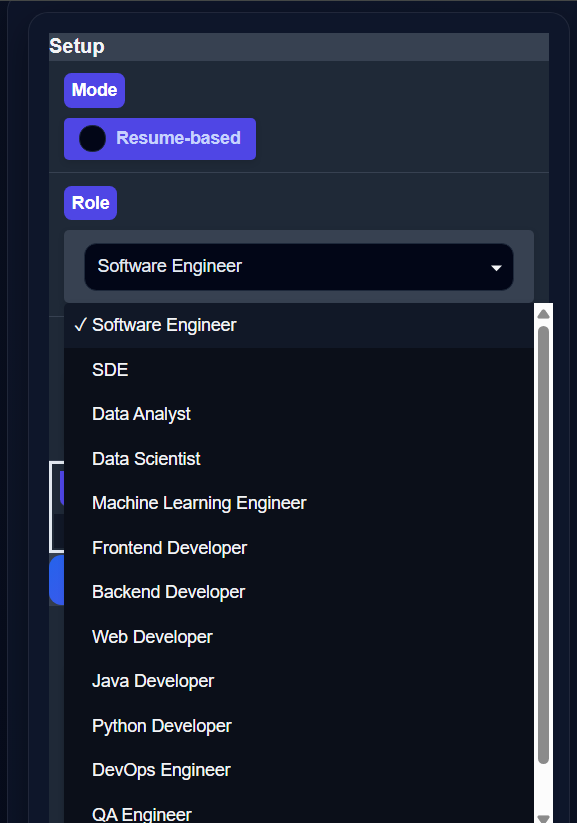
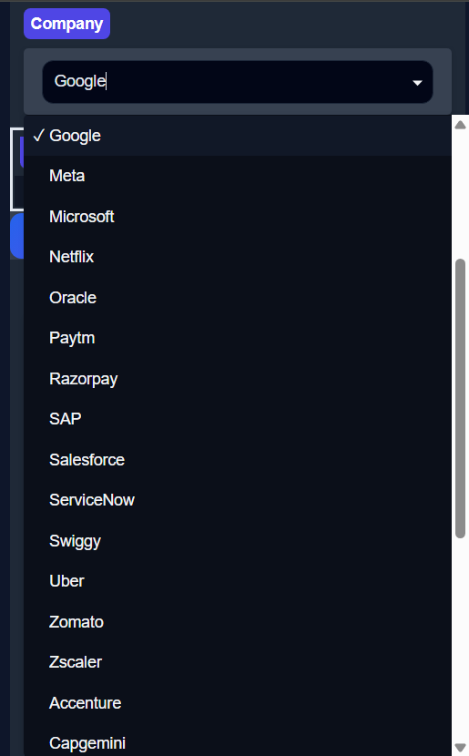
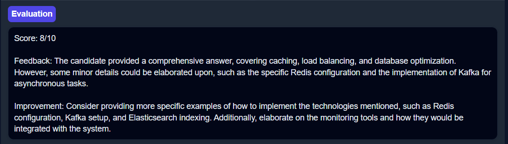
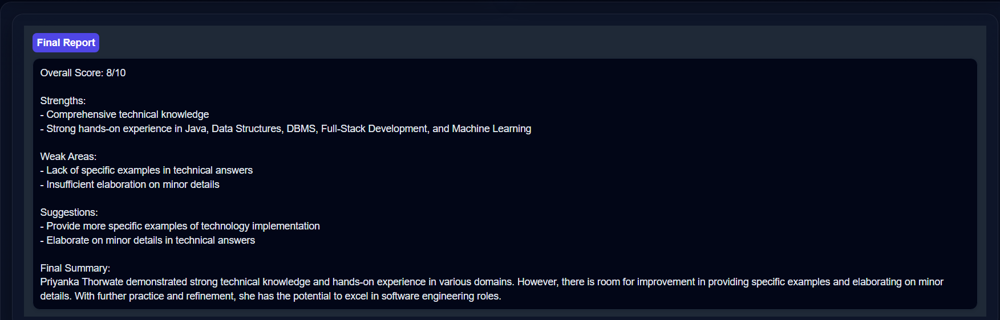
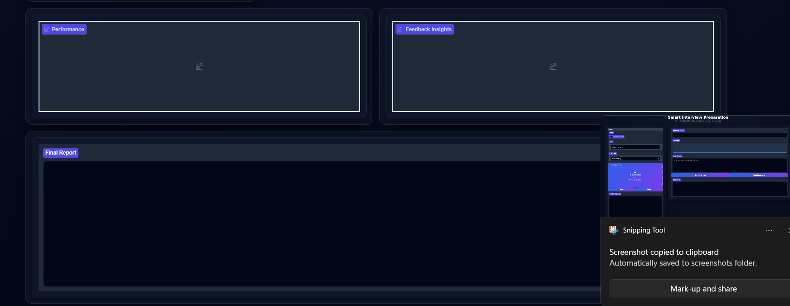

AI Interview Preparation Agent

Overview

AI Interview Preparation Agent is an intelligent interview coaching platform that leverages Large Language Models (LLMs) to conduct personalized mock interviews.

The system analyzes a candidate's resume, identifies technical skills and projects, generates customized interview questions, evaluates responses, provides improvement suggestions, and generates a detailed performance report.

The platform supports multiple job roles and company types, allowing candidates to prepare for both product-based and service-based company interviews.

---

Key Features

• Resume Parsing (PDF Support)

• Resume-Based Interview Generation

• Role-Specific Interview Questions

• Company-Specific Question Customization

• Technical and HR Interview Preparation

• AI-Powered Answer Evaluation

• Automated Feedback Generation

• Performance Analytics Dashboard

• Final Interview Assessment Report

• Interactive Gradio User Interface

---

Problem Statement

Candidates often struggle to prepare for interviews because they lack personalized practice and detailed feedback.

This project addresses this challenge by providing an AI-powered mock interview platform that:

• Understands candidate profiles

• Generates personalized interview questions

• Evaluates answers

• Identifies strengths and weaknesses

• Recommends areas for improvement

---

System Workflow

1. Upload Resume
2. Select Job Role
3. Select Company
4. Generate Candidate Profile
5. Generate Interview Questions
6. Submit Answers
7. AI-Based Evaluation
8. Performance Analysis
9. Final Feedback Report

---

Supported Roles

• Software Engineer
• SDE
• Data Analyst
• Data Scientist
• Machine Learning Engineer
• Frontend Developer
• Backend Developer
• Web Developer
• Java Developer
• Python Developer
• DevOps Engineer
• QA Engineer
• Business Analyst

---

Supported Companies

Product-Based Companies

• Google
• Microsoft
• Meta
• Netflix
• Salesforce
• Uber
• Oracle
• SAP
• Razorpay
• Paytm

Service-Based Companies

• TCS
• Infosys
• Wipro
• Accenture
• Cognizant
• Capgemini
• HCL
• LTIMindtree

---

Technologies Used

Frontend

• Gradio

Backend

• Python

AI & NLP

• Groq API
• Llama 3.1

Data Processing

• Pandas

Document Parsing

• PyPDF
• Python-Docx

Visualization

• Plotly

---

Application Screenshots

### Home Page

### Resume Analysis and Question Generation

### Role Selection

### Company Selection

### Answer Evaluation

### Final Feedback Report

### Analytics Dashboard

---

AI Capabilities

Resume Analysis

• Extracts Skills
• Extracts Projects
• Generates Candidate Summary

Question Generation

• Technical Questions
• Project-Based Questions
• HR Questions

Answer Evaluation

• Technical Accuracy
• Communication Quality
• Completeness
• Problem Solving Approach

Final Feedback

• Overall Score
• Strengths
• Weak Areas
• Improvement Suggestions

---

Future Improvements

• Voice-Based Interviews
• Speech-to-Text Support
• Video Interview Simulation
• ATS Resume Analysis
• Coding Round Evaluation
• Progress Tracking Dashboard
• Multi-Language Support

---

Requirements

gradio
groq
pandas
plotly
pypdf
python-docx

---

